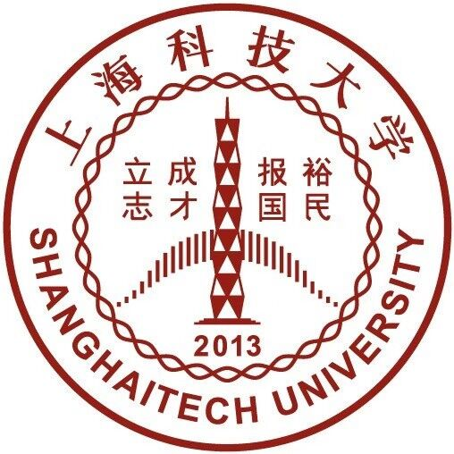

## ShanghaiTech University, School of Information Science and Technology (SIST)

- B.Eng. Candidate, Computer Science and Technology
- Sept. 2020 - July 2024 (Expected)
- GPA: 3.96/4.0
- Rank in SIST: 1/247

## Massachusetts Institute of Technology, EECS Department

- Undergraduate Special Student (A non-degree student taking classes at MIT)
- Feb. 2023 - May 2023
- GPA: /5.0